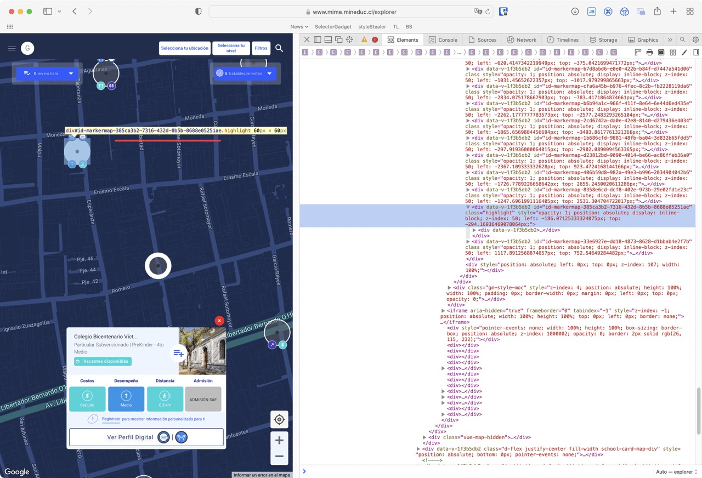

```{r}
#| echo = FALSE,
#| warnings = FALSE
suppressPackageStartupMessages(library(tidyverse))
suppressPackageStartupMessages(library(rvest))
library(httr)
library(knitr)

opts_chunk$set(cache.path = "class_10_files/class_10_cache/html/",
               fig.align = 'center')
```


## Motivación

- Obtener datos generados dinámicamente por javascript emulando un navegador con `chromote`. 

  - Recuento y resumen de lo visto.

---

## Paquetes para la clase de hoy

Grupo de paquetes interrelacionados:

- [chromote](https://rstudio.github.io/chromote/): Implementación de [Chrome DevTools Protocol](https://chromedevtools.github.io/devtools-protocol/) en R para manejar un navegador programáticamente.

- [polite](https://dmi3kno.github.io/polite/): promueve una conducta responsable.


---

## Motivación 1

.pull-left[
- Enfretamos una página que procesa y genera contenido mediante JavaScript o acciones del navegador.

- La captura del html de ella no entregará información requerida. 

- Podemos entonces controlar un navegador sin cabeza (*[headless browser](https://en.wikipedia.org/wiki/Headless_browser)*) para generar acciones y obtener los datos demandados.
]

.pull-right[
- Ejemplo [MIME Mineduc](https://www.mime.mineduc.cl/explorer)


]


---

## Motivación 2

.pull-left[
- La página es una vista de Google Maps con información georreferenciada de cada escuela.

- Datos de cada escuela se despliegan al momento de hacer clic sobre su ubicación.

- Nuevas escuelas se cargan a medida que se desplaza o agranda el mapa.

- Queremos obtener la **información de las escuelas**.
]

.pull-right[
- Ejemplo [MIME Mineduc](https://www.mime.mineduc.cl/explorer)


]


---

## Motivación 3

.pull-left[
- Al capturar su contenido sólo con `rvest` obtenemos lo siguiente:

  No funciona sin un navegador que tenga JavaScript disponible.
]

.pull-right[
```{r}
url <- 'https://www.mime.mineduc.cl/explorer'
read_html(url) |> 
  html_element('body strong') |> 
  html_text()
```
]


---

## Explorar página web 1

.pull-left[
- Imágenes del mapa cargan a medida que uno desplaza la venta del navegador.
]

.pull-right[

]


---

## Explorar página web 2

.pull-left[
- La información de una escuela se accede mediante:

  - POST: Información parcial a partir de una búsqueda.
  
]

.pull-right[

]


---

## Explorar página web 3

.pull-left[
- La información de una escuela se accede mediante:

  - POST: Información parcial a partir de una búsqueda.
  
    En el *body* del POST se envía un `uuid`: 
    `385ca3b2-7316-432d-8b5b-8688e05251ae`
]

.pull-right[

]


---

## Explorar página web 4

.pull-left[
- La información de una escuela se accede mediante:

  - POST: Información parcial a partir de una búsqueda.
  
  - GET: Información de *perfil digital*. Usa el `uuid` en la url.
]

.pull-right[

]


---

## Explorar página web 5

.pull-left[
- ¿Dónde obtengo el `uuid`?

  - Forma parte del `id` del `<div>` que designa a ese punto geográfico.

.font40[
```html
<div data-v-1f3b5db2="" 
  id="id-markermap-385ca3b2-7316-432d-8b5b-8688e05251ae">
  ...
</div>
```
]

- ¿Cómo puedo obtener esa información?

]

.pull-right[

]


---

## chromote

- Para su uso se recomienda tener Google Chrome instalado.

- Pasos:

  1. Crear una instancia del navegador controlado desde R.
  1. Abrir una ventana.
  1. Ir al sitio web.
  1. Capturar los atributos que comiencen con `id-markermap`.
  
---

## chromote: Acceso a sitio web

Navegar hasta sitio de interés.

.pull-left.font70[
```{r}
library(chromote)
b <- ChromoteSession$new() # Nuevo navegador.
b1 <- b$new_session() # Nueva "ventana".

# Ir a sitio web de interés
b1$Page$navigate("https://www.mime.mineduc.cl/explorer/")
Sys.sleep(20) # Tiempo para que la página cargue.
```

```{r}
# Se puede ver lo que hace esta "ventana":
# b1$view()
```
]

.pull-right[

]


---

## chromote: Captura de atributos 1

- Obtenemos del navegador el nodo raíz (`root`) del [Document Object Model o DOM](https://en.wikipedia.org/wiki/Document_Object_Model) de la página que está viendo.
- Usamos función [getDocument](https://chromedevtools.github.io/devtools-protocol/tot/DOM/#method-getDocument).

.font70[
```{r}
x1 <- b1$DOM$getDocument()

x1$root |> str(2)
```
]


---

## chromote: Captura de atributos 2

- Dentro de los nodos del documento, se buscarán elementos `<div>` cuyo atributo `id` comience con `id_markermap`.

```{r}
div_ids <- b1$DOM$querySelectorAll(x1$root$nodeId, "div[id^=id-markermap]")

div_ids$nodeIds |> unlist() |> head()
```

- Posición de los nodos de interés.

---

## chromote: Captura de atributos 3, mediante html

- Con los nodos de interés, puedo acceder a su html mediante [getOuterHTML](https://chromedevtools.github.io/devtools-protocol/tot/DOM/#method-getOuterHTML)

```{r}
try(
  b1$DOM$getOuterHTML(div_ids$nodeIds[[1]])[[1]] |>
    read_html() |>
    html_element('div') |>
    html_attr('id')
)
```


---

## chromote: Captura de atributos 4, mediante atributos

- Con los nodos de interés, puedo más directamente al atributo con [getAttributes](https://chromedevtools.github.io/devtools-protocol/tot/DOM/#method-getAttributes)

.font70[
```{r}
try(b1$DOM$getAttributes(div_ids$nodeIds[[1]])$attributes[[4]])
```
]

Capturar el atributo para todos los atributos que tengo identificados usando `map`.

.font70[
```{r}
try(l_uuid <- map_chr(div_ids$nodeIds,
                      ~b1$DOM$getAttributes(.)$attributes[[4]]))
try(length(l_uuid))
```

```{r}
try(l_uuid |> head())
```
]


---

## chromote: Captura de atributos 5

.pull-left[
Se capturó el código `uuid` de `r length(l_uuid)` establecimientos. 

Para capturar más establecimientos, se puede mover el mapa… y *ampliar la ventana*.

.font70[
```{r}
# Agrandamos el tamaño del navegador.
b1$Browser$setWindowBounds(
  windowId = b1$Browser$getWindowForTarget()$windowId,
  bounds = list(width = 4000, height = 6000)
  )

Sys.sleep(20) # Tiempo para que la página cargue.

if(interactive()){
  b1$view()
}
```
]
]

.pull-right[

]


---

## chromote: Captura de atributos 6

Capturamos un mayor número de `uuid`.

```{r}
div_ids <- b1$DOM$querySelectorAll(x1$root$nodeId, "div[id^=id-markermap]")

l_uuid <- map_chr(div_ids$nodeIds,
                  ~b1$DOM$getAttributes(.)$attributes[[4]])

length(l_uuid)
```

```{r}
#| echo = FALSE,
#| include = FALSE

if(interactive()){
  l_uuid <- readRDS('slides/class_10/class_10_files/l_uuid_chromote_500.rds')
} else {
  l_uuid <- readRDS('class_10_files/l_uuid_chromote_500.rds')
}

```


Cerrar el navegador.

```{r}
try(b1$parent$close())
```

---

## httr: POST búsqueda 1

- Sistema anterior nos permite capturar `uuid` de un área geográfica específica, sin tener claro que colegios se muestran o no.

- Se puede usar POST para buscar escuelas luego de analizar el tráfico.

.font70[
```{r}
escuela <- 'Colegio Bicentenario Victoria Prieto'

resp <- POST(url = 'https://api.consiliumbots.com/service-search-engine/search/campuses//',
             query = list(language_code = 'es'),
             accept_json(),
             add_headers('accept-encoding' = 'gzip',
                         'x-index' = 'chile-campuses-master'),
             body = list(search_partial = 'true',
                         search_size = 20,
                         search_term = escuela))
```
]

---

## httr: POST búsqueda 2

- Datos de búsqueda para `r escuela`. 

  ¡Nos permite buscar el `uuid` por nombre o RBD!

.font70[
```{r}
resp |> content('text') |> jsonlite::fromJSON() |> str(1)
```
]


---

## httr: POST búsqueda 3

- Crear función para la captura de datos.

.font70[
```{r}
f_mime_busqueda <- function(.search_term){
  # Recepción de la respuesta
  response <- POST(url = 'https://api.consiliumbots.com/service-search-engine/search/campuses//',
                   query = list(language_code = 'es'),
                   accept_json(),
                   add_headers('accept-encoding' = 'gzip',
                               'x-index' = 'chile-campuses-master'),
                   body = list(search_partial = 'true',
                               search_size = 20,
                               search_term = .search_term))
  
  response |> 
    content('text', encoding = 'UTF-8') |> 
    jsonlite::fromJSON()
}

f_mime_p_response <- function(.response){
  # Respuesta de POST a tibble
  tibble(data        = .response$results,
         search_term = .response$search) |> 
    unpack(data)
}
```
]

---

## httr: POST búsqueda 4

Prueba con algunos colegios

.pull-left.font70[
```{r}
df_escuelas <- tibble::tribble(
   ~rbd,                                ~nombre,
  8928L,       "LICEO JOSE VICTORINO LASTARRIA",
  8931L,             "ESCUELA BASICA EL VERGEL",
  8933L,               "ESCUELA DE PROVIDENCIA",
  8992L,    "COLEGIO ALEMAN SANKT THOMAS MORUS"
  )
```
]

.pull-right.font70[
- Buscar por **`rbd`**. Aparecen más que una sola pareja.

```{r}
df <- f_mime_busqueda(df_escuelas$rbd[1]) 

df_unpack <-  df |> 
  f_mime_p_response()

df_unpack |> select(id, uuid, institution_name, institution_code)
```
]


---

## httr: POST búsqueda 5

.font70[
- Buscar por **nombre**. También parecen varios resultados.

```{r}
df <- f_mime_busqueda(df_escuelas$nombre[1]) 

df_unpack <-  df |> 
  f_mime_p_response()

df_unpack |> select(id, uuid, institution_name, institution_code)
```
]


---

## httr: POST búsqueda 6

Obtener información de `df_escuelas` según `rbd` usando map.

.font70[
```{r}
df_rbd <- map(df_escuelas$rbd, 
              f_mime_busqueda) 

df_unpack <-  map_dfr(df_rbd, 
                      f_mime_p_response)

df_unpack |> select(id, uuid, institution_name, institution_code)
```
]


---

## rvest: información de detalle 1

Para la información de detalle, es posible usar simplemente `jsonlite::fromJSON`, si se conoce el `uuid`.

.pull-left.font70[
```{r}
f_uuid_detalle <- function(.uuid){
  jsonlite::fromJSON(str_glue(
    'https://api.consiliumbots.com/explorer-backend/r/chile/institutions/campuses/{.uuid}/'
    ))
}

x <- f_uuid_detalle(df_unpack$uuid[[1]])
```
]

.pull-right.font40[
- Lista de respuesta

```{r}
x |> str(1)
```
]


---

## rvest: información de detalle 2

Capturar la información de todos los `uuid` que hemos capturado.

.font70[
```{r}
#| cache = TRUE
l_info <- map(df_unpack$uuid, 
              f_uuid_detalle)

df_info <- l_info |> 
  enframe() |> 
  unnest_wider(value)

head(df_info, 2)
```
]


---

## rvest: información de detalle 3

Capturar la información de todos los `uuid` que hemos capturado.

.font70[
```{r}
#| cache = TRUE
df_uuid <- l_uuid[1:20] |> 
  str_remove('id-markermap-') |> 
  map(f_uuid_detalle)

df_uuid <- df_uuid |> 
  enframe() |> 
  unnest_wider(value)

df_uuid
```
]


---

## Referencias adicionales:

- [RSelenium](https://docs.ropensci.org/RSelenium/index.html). Otro paquete para manejo de un navegador sin cabeza. 


---
class: inverse, middle

Presentación y código en GitHub:  
<https://github.com/caayala/web_scraping_soc40XX>  

<https://caayala.github.io/web_scraping_soc40XX/>


---
class: inverse, center, middle

.huge[
¡Gracias!
]

<br>
Cristián Ayala  
<https://blog.desuc.cl/>  
<http://github.com/caayala>


```{r}
#| echo = FALSE,
#| include = FALSE

# Extraer código R
knitr::purl('class_10.Rmd',
            output = 'class_10.R',
            quiet = TRUE)
```
