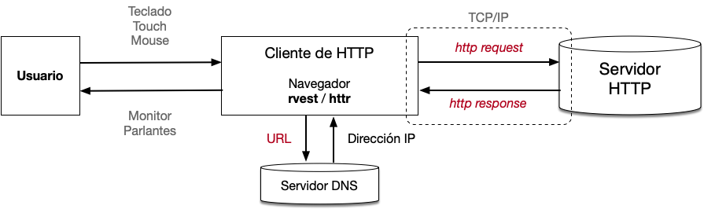
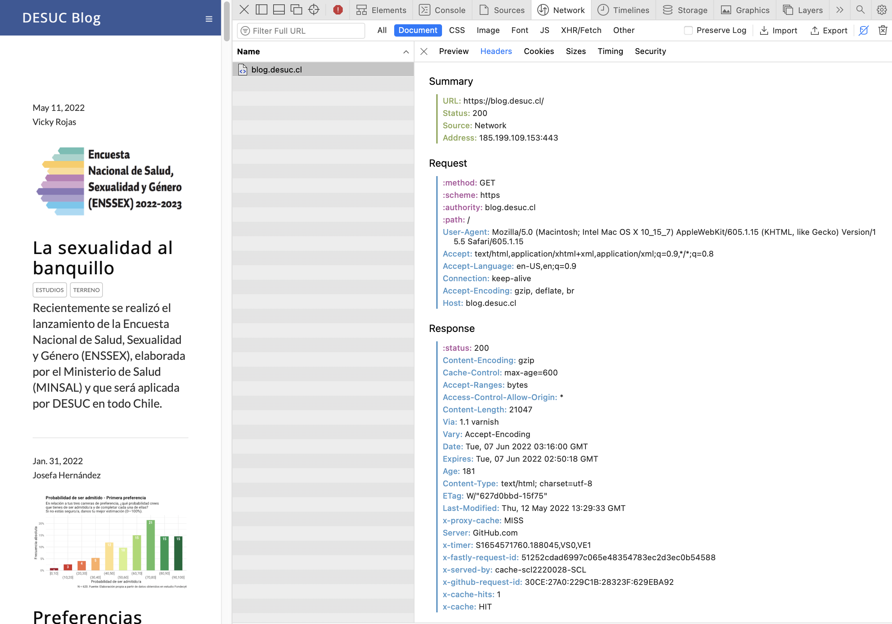

```{r}
#| echo = FALSE
suppressPackageStartupMessages(library(tidyverse))
suppressPackageStartupMessages(library(rvest))
library(httr)
library(knitr)
opts_chunk$set(cache.path = "class_5_files/class_5_cache/html/",
               fig.align = 'center')
```


## Esquema general de un web scraping.

Estamos en condiciones de entender este esquema:

```{r}
#| fig.alt = 'Relación entre pasos para capturar sitios webs y funciones en R',
#| out.width = '70%',
#| echo = FALSE
knitr::include_graphics('https://github.com/yusuzech/r-web-scraping-cheat-sheet/raw/master/resources/functions_and_classes.png')
```

.footnote[
Fuente: [Web Scraping Reference, Cheat Sheet for Web Scraping using R](https://github.com/yusuzech/r-web-scraping-cheat-sheet)
]

---

## HTTP Conversación general

Veamos en detalle el protocolo HTTP al momento de comunicarse con un servidor HTTP. 



* Por HTTP además de texto se transmiten muchos otros documentos

* HTTP no tiene mantiene el estado, es *stateless*. Sin más, cada comunicación es como si fuese nueva.

---

## URL

*Uniform Resource Locators* o URL tienen la siguiente forma:

`scheme://hostname:port/path?querystring#fragment`

- *scheme*: protocolo de conexión al servidor (http, https, ftp, mailto,…).

- *hostname*: nombre del servidor al se quiere acceder. Servidor de DNS lo transforma a dirección IP.

- *port*: puerta a la que se quiere entrar (80 es el puerto por defecto de TCP) .

- *path*: ubicación del recurso solicitado en el *hostname*.

- *query string*: información anexa enviada al servidor en pares `var1=val1&var2=val2…`.

- *fragment*: ubicación dentro de un archivo específico.

<br>

[`http://www.google.com:80/search?q=r+cheat+sheet+filetype%3Apdf`](http://www.google.com:80/search?q=r+cheat+sheet+filetype%3Apdf)


---

## URL Encode

Las URLs usan solo los 128 caracteres de [ASCII](https://es.wikipedia.org/wiki/ASCII). Todas las letras no incluidas deben ser sustituidos por una representación en ellos.

Funciones para trabajar con [Código URL](https://es.wikipedia.org/wiki/Código_porciento):

```{r}
text <- "¡Hola! Soy Cristián y tengo 43 años"

(text_url <- URLencode(text))
```

```{r}
(URLdecode(text_url))
```

Nota: el `+` del ejemplo anterior solo sirve porque es un espacio en la parte de búsqueda, *query*, de la dirección. En otros casos la codificación de " " es `%20`.


---

## HTTP Requerimiento

La comunicación se efectúa intercambiando mensajes que contienen **tres partes**. 

Mensaje con **request**:

.pull-left[
- *Primera línea*: 

    Método, path y versión

- *Cabeza*: 
    
    Nombre1: Valor1<br>
    Nombre2: Valor2

- *Cuerpo*: datos a comunicar
]

.pull-right[
- *Primera línea*: 
    
    `POST /edicion.html HTML/1.1`

- *Cabeza* : 
  
    `Host: es.wikipedia.org`
    <br><br>

- *Cuerpo*: 

    `Quiero agregar esta línea al texto.`
]


---

## HTTP Respuesta

La comunicación se efectúa intercambiando mensajes que contienen **tres partes**. 

Mensaje con **response**:

.pull-left[
- *Primera línea*: 

    versión, estado y frase

- *Cabeza*: 
    
    Nombre1: Valor1<br>
    Nombre2: Valor2

- *Cuerpo*: datos a comunicar
]

.pull-right[
- *Primera línea*: 
    
    `HTTP/1.1 200 OK`

- *Cabeza* : 
  
    `Content-type: text/plain`
    <br><br>

- *Cuerpo*: 

    `El mensaje fue agregado con éxito.`
]


---

## HTTP Métodos de requerimientos

Los [métodos de requerimientos](https://www.w3schools.com/tags/ref_httpmethods.asp) más comunes son los siguientes:

| Método | Descripción |
| :--- | : ------ | 
| GET  | Pide recurso del servidor |
| POST | Pide recurso del servidor enviando en el cuerpo datos o archivos | 
| HEAD | Como GET, pero servidor solo devuelve start line y header|
| PUT | Guarda el cuerpo en el servidor |
| DELETE | Borra recurso del servidor |
| TRACE | Sigue la ruta del mensaje hasta llegar al servidor |
| OPTIONS | Devuelve la lista de métodos HTTP compatibles |
| CONNECT | Establece una conexión de red |

Los más importantes son `GET` y `POST` porque piden cosas al servidor.


---

## HTTP Códigos de respuesta 1

.pull-left[

Cuando se pide algo a un servidor, este entregará una respuesta, el *status code* [Códigos de respuesta](https://www.w3schools.com/tags/ref_httpmessages.asp). Van desde 100 a 599.

Hay 5 bloques de códigos: 

| Código | Mensaje |
| :--- | :----------- |
| 1xx  | Respuestas informativas |
| 2xx  | Peticiones correctas |
| 3xx  | Redirecciones |
| 4xx  | Errores del cliente |
| 5xx  | Errores de servidor |
]

.pull-right.font70[
Ejemplos relevantes:

- **`200` OK** Petición correctas <br>

- **`400` Bad Request** Servidor no procesará la solicitud

- **`404` Not found** Recurso no encontrado
]


---

## HTTP Códigos de respuesta 2

- Sitio no existe

```{r}
httr::GET(url = 'https://blog.desuc.cl/test.html') |> httr::http_status()
```

- Respuesta OK

```{r}
rvest::session(url = 'https://blog.desuc.cl/')
```


---

## HTTP Cabeceras 1

.pull-left[
La cabecera ---headers--- definen las acciones a tomar al momento de la recepción de un requerimiento o respuesta.

- *Accept* (request): tipo de contenido que el cliente puede recibir.
- *Accept-Encoding* (request): métodos de compresión o codificación que puede aceptar el cliente.
- *Authorization* (request): método sencillo para enviar credencial del cliente al servidor.
- *Content-Type* (response; body): tipo de contenido en el cuerpo de la respuesta.
- *Cookie* (request): información hacia el servidor. Envío información previamente recibida en *Set-Cookie* (response).
- *User-Agent* (request): descripción del [tipo de cliente](http://httpbin.org/user-agent) que hace el requerimiento.
]

.pull-right.font70[
Un ejemplo de cabecera de requerimiento (GET):

```{r}
s_blog <- GET(url = 'https://blog.desuc.cl')

s_blog$request
```
]


---

## HTTP Cabeceras 2

El intercambio de información se puede ver también el inspector del navegador de preferencia:

```{r}
#| fig.alt = 'Ejemplo de headers',
#| out.width = '70%',
#| echo = FALSE

```


---

## HTTP Cabeceras de respuesta

Ejemplo de cabecera de respuesta luego de capturar <https://blog.desuc.cl>:

```{r}
s_blog |> headers() |> enframe() |> mutate(value = as.character(value))
```


---

## HTTP Modificación parámetros 1

Agregar parámetros a la cabecera del requerimiento: Variables en URL.

.font70[
```{r}
resp <- GET('http://httpbin.org/get',
            query = list(var1 = "valor1", 
                         var2 = "valor2"), #URL values
            authenticate('usuario', 'clavesegura'),
            user_agent(agent = 'hola mundo'),
            set_cookies(a = 1),
            accept_json(),
            add_headers(class = "Web Scraping UC", year = 2022))
```

1. Valores en la `URL`.

1. Autentificación con *nombre* y *clave*.

1. Cambio en el User-agent. Se le dice *spoofing*.

1. Ajuste de cookies.

1. Declaro aceptar archivos json.

1. Agregar variables personalizadas.
]


---

## HTTP Modificación parámetros 2

Respuesta obtenida luego de agregar manualmente parámetros al requerimiento: 

```{r}
resp
```


---

## HTTP Cookies en cabeceras

Con las cookies de un sitio web podemos mantener información de la sesión.

.font70[
```{r}
(git_cookies <- GET('http://github.com') |> cookies())
```
]

Listado de pares nombre = valor de cookies para nuevas conexiones:

.font70[
```{r}
git_cookies |> pull(value, name) |> str_trunc(width = 70)
```
]

---

## HTTP User-agent

- Para recibir el User-Agent se puede usar <http://httpbin.org/user-agent>. Su descripción [aquí](http://useragentstring.com/index.php).

- `httr` se muestra en el User-Agent. El servidor puede saber que está siendo requerido para un web scraping.

```{r}
GET('http://httpbin.org/user-agent')
```

En este momento, el User-Agent de mi navegador (Safari) es:

```
Mozilla/5.0 (Macintosh; Intel Mac OS X 10_15_7) AppleWebKit/605.1.15 (KHTML, like Gecko) Version/15.5 Safari/605.1.15
```


---

## HTTP Modificación de cookies 1

.pull-left.font70[
Las cookies las envía el servidor en su respuesta. Podemos crear cookies de prueba en esta sesión.

```{r}
GET('http://httpbin.org/cookies/set?c1=tritón')
```
]

.pull-right.font70[
En siguientes visitas a ese mismo sitio web, esas cookies se mantienen

```{r}
GET('http://httpbin.org/cookies') |> 
  cookies() |> t()
```
]


---

## HTTP Modificación de cookies 2

.pull-left.font70[

Puedo agregar información de cookies, manualmente. No quedará guardada en el servidor.

```{r}
GET('http://httpbin.org/cookies',
    set_cookies('x1' = 'vino'))
```
]

.pull-right.font70[
```{r}
GET('http://httpbin.org/cookies') |> 
  cookies() |> t()
```
]


---

## Acceso a información: Spoofing Headers 1

Ejemplo de [Spoofing Headers](https://www.scrapethissite.com/pages/advanced/?gotcha=headers). 

.font70[
```{r}
f_container_row <- function(.get){
  .get |> read_html() |> html_element('.container .row') |> html_text() |> str_squish()
}

GET('https://www.scrapethissite.com/pages/advanced/?gotcha=headers') |> f_container_row()
```
]


---

## Acceso a información: Spoofing Headers 2

1. Resolvemos problema con `accept()`.

```{r}
GET('https://www.scrapethissite.com/pages/advanced/?gotcha=headers',
    accept('text/html')) |> f_container_row()
```

2. Resolvemos problema con `user-agent()`.

```{r}
GET('https://www.scrapethissite.com/pages/advanced/?gotcha=headers',
    user_agent('Mozilla/5.0 (Macintosh; Intel Mac OS X 10_15_7) AppleWebKit/605.1.15 (KHTML, like Gecko) Version/15.5 Safari/605.1.15'),
    accept('text/html')) |> f_container_row()
```
]


---

## Acceso a información: Autentificación 1

Ejemplo de [Logins & Session Data](https://www.scrapethissite.com/pages/advanced/?gotcha=login). 


```{r}
GET('https://www.scrapethissite.com/pages/advanced/?gotcha=login') |> f_container_row()
```

Llenado de formulario usando `httr` y el método [POST]().

```{r}
httr::POST('https://www.scrapethissite.com/pages/advanced/?gotcha=login',
     body = list(user = 'test', pass = 'test')) |> f_container_row()
```


---

## Acceso a información: Autentificación 2

Llenado de formulario usando `rvest`

```{r}
s <- session('https://www.scrapethissite.com/pages/advanced/?gotcha=login')
f <- html_form(s)[[1]]

f_llena <- f |> html_form_set(user = 'test', pass = 'test')
# Pequeño hack porque la forma no tiene el atributo "action".
f_llena$action <- 'https://www.scrapethissite.com/pages/advanced/?gotcha=login'

f_llena |> html_form_submit() |> f_container_row()
```

.footnote[
Referencia de hack: <https://github.com/tidyverse/rvest/issues/319>
]


---

## En el próximo taller… 

- Captura de sitios con login y modificación de encabezados.


---
class: inverse, middle

Presentación y código en GitHub:  
<https://github.com/caayala/web_scraping_soc40XX>  

<https://caayala.github.io/web_scraping_soc40XX/>


---
class: inverse, center, middle

.huge[
¡Gracias!
]

<br>
Cristián Ayala  
<https://blog.desuc.cl/>  
<http://github.com/caayala>


```{r}
#| echo = FALSE,
#| include = FALSE

# Extraer código R
knitr::purl('class_5.Rmd',
            output = 'class_5.R',
            quiet = TRUE)
```
