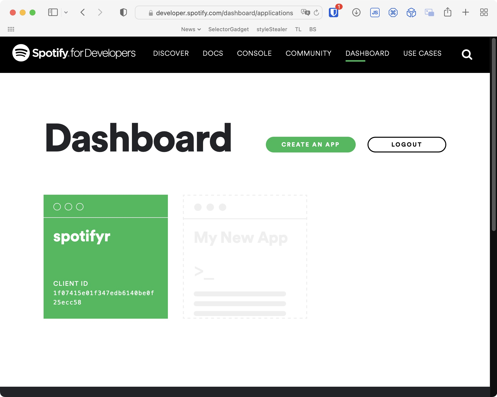

```{r}
#| echo = FALSE
suppressPackageStartupMessages(library(tidyverse))
suppressPackageStartupMessages(library(rvest))
library(httr)
library(knitr)

opts_chunk$set(cache.path = "class_9_files/class_9_cache/html/",
               fig.align = 'center')
```


## Motivación

- Utilizar *puertas* provistas por servicios web para acceder a su información.

  - Wikipedia, Spotify, Twitter.

- Revisar paquetes ya desarrollados para acceder a servicios populares.

---

## Paquetes para la clase de hoy

Grupo de paquetes interrelacionados:

- [WikipediR](https://github.com/Ironholds/WikipediR/): Empaqueta la API de MediaWiki para bajar datos de Wikipedia.

- [spotifyr](https://www.rcharlie.com/spotifyr/): Empaqueta la API de Spotify para bajar datos.

- [rtweet](https://docs.ropensci.org/rtweet/): Permite interactuar con la API de Twitter.

- [academictwitteR](https://github.com/cjbarrie/academictwitteR): Acceso a la APIv2 de Twitter para su producto académico.


---

## Wikipedia

El software sobre el que está montada Wikipedia ---[MediaWiki](https://en.wikipedia.org/wiki/MediaWiki#Application_programming_interface)--- cuenta con una API 
para acceder al contenido almacenado en sus bases de datos.

- MediaWiki API: [Página principal](https://www.mediawiki.org/wiki/API:Main_page)

Veamos la documentación y como crear llamados en la [sandbox](https://www.mediawiki.org/wiki/Special:ApiSandbox) disponible

---

## Wikipedia: API

Revisemos la [API de Wikipedia](https://www.mediawiki.org/wiki/API:Main_page). 

- Revisión de acciones disponibles.
  - [`Search`](https://www.mediawiki.org/wiki/API:Search): Buscar páginas.

  - [`Parse`](https://www.mediawiki.org/wiki/API:Parsing_wikitext): Obtener contenido de una página.
  
  - [`Query`](https://www.mediawiki.org/wiki/API:Query): Obtener información de páginas.

Captura de página sobre *web scraping* en español.


---

## Wikipedia: API buscar API:Search

Construcción de GET para la acción [`Search`](https://www.mediawiki.org/wiki/API:Search).

.font70[
```{r}
resp <- GET('https://es.wikipedia.org/w/api.php',
            query = list(action = 'query',
                         list = 'search',
                         srsearch = 'web scraping',
                         srlimit = 5,
                         format = 'json'),
            add_headers('Accept-Encoding' = 'gzip'))

df <- content(resp, as = 'text') |> 
  jsonlite::fromJSON()

df$query$search |> as_tibble()
```
]


---

## Wikipedia: API contenido API:Parse 1

Obtención del contenido de página. GET para la acción [`Parse`](https://www.mediawiki.org/wiki/API:Parsing_wikitext).

```{r}
resp <- GET('https://es.wikipedia.org/w/api.php',
            query = list(action = 'parse',
                         page = 'Web scraping', # contenido de título de página
                         prop = 'text', # html de retorno
                         format = 'json'),
            add_headers('Accept-Encoding' = 'gzip'))

df <- content(resp, as = 'text') |> jsonlite::fromJSON()

str(df, 2)
```


---

## Wikipedia: API contenido API:Parse 2

El texto de contenido

.font40[
```{r}
df$parse$text$`*` |> 
  read_html() |> html_text() |> 
  cat()
```
]


---

## Wikipedia: API información API:Query 1

Información de varias páginas. GET para la acción [`Query`](https://www.mediawiki.org/wiki/API:Query).

```{r}
resp <- GET('https://es.wikipedia.org/w/api.php',
            query = list(action = 'query',
                         titles = 'Web scraping|Python', # Varios títulos a la ves.
                         prop = 'info|categories|iwlinks', # Información a obtener.
                         format = 'json'),
            add_headers('Accept-Encoding' = 'gzip'))

df <- content(resp, as = 'text') |> jsonlite::fromJSON()

str(df, 3)
```


---

## Wikipedia: API información API:Query 2

.font70[
```{r}
df$query$pages |> 
  enframe() |> unnest_wider(value)
```
]


---

## Wikipedia: usando WikipediR 1

Lo mismo, pero más fácil.

.pull-left.font70[
- `page_info`: información sobre una página específica.

- `page_content`: contenido de una página específica.

- `page_links`: links disponibles en una página específica.


```{r}
library(WikipediR)

info_wiki <- page_info(
  language = 'es', 
  project = 'wikipedia', 
  page = 'Web_scraping|Python') 
```
]

.pull-right.font70[
```{r}
str(info_wiki, 3)
```
]


---

## Wikipedia: usando WikipediR 2

Resultado de la búsqueda.

.font70[
```{r}
info_wiki$query$pages |> 
  enframe() |> unnest_wider(value)
```
]


---

## Wikipedia: usando WikipediR 3

Captura de página sobre *web scraping* en español.

.font70[
```{r}
cont_wiki <-  page_content(language = 'es', 
                           project = 'wikipedia', 
                           page_name = 'Web_scraping')

str(cont_wiki) # Una lisa parse con 4 elementos dentro
```
]


---

## Wikipedia: usando WikipediR 4

Texto sobre Web scraping.

.font40[
```{r}
cont_wiki$parse$text$`*` |> # Texto del requerimiento
  read_html() |> html_text() |> 
  cat()
```
]


---

## Spotify

.pull-left[
Uno de los mayores proveedores de servicio de música del mundo. 
Tiene disponible una API para la integración de su servicio con otras aplicaciones. Podemos usarla para obtener información

- Spotify API: [quick start](https://developer.spotify.com/documentation/web-api/quick-start/)

- Requiere tener cuenta en Spotify y [crear un token](https://developer.spotify.com/dashboard/).
]

.pull-right[

]


---

## Spotify: API 1

Revisemos la [API de Spotify](https://developer.spotify.com/documentation/web-api/). Acciones de interés.

- [`Search`](https://developer.spotify.com/documentation/web-api/reference/#/operations/search): Buscar.
  
- [`get-playlist`](https://developer.spotify.com/documentation/web-api/reference/#/operations/get-playlist): Datos sobre una lista.
  
- [`get-several-audio-features`](https://developer.spotify.com/documentation/web-api/reference/#/operations/get-several-audio-features): Información psico--acústica de canciones.


---

## Spotify: API 2

Búsqueda de género metal usando la API directamente. Pedí el token de acceso usando `spotifyr`.

.font70[
```{r}
s_met <- GET('https://api.spotify.com/v1/search',
             query = list(q = 'genre:metal', 
                          market = 'CL', 
                          type = 'artist', 
                          limit = 8),
             accept_json(),
             add_headers(Authorization = str_glue("Bearer {spotifyr::get_spotify_access_token()}")))

df_met <- s_met |> content('text') |> 
  jsonlite::fromJSON()

df_met$artists$items |> 
  as_tibble() |> unpack(followers, names_repair = 'minimal') |>
  select(id, name, popularity, total)
```
]


---

## Spotify: spotifyr 1

Envuelve los llamados a la API de Spotify en funciones de R.
Puede verse su [referencia](https://www.rcharlie.com/spotifyr/reference/index.html)

Búsqueda análoga a la anterior:

.font70[
```{r}
library(spotifyr)

df_met <- get_genre_artists('metal', limit = 8)
df_met |> 
  select(id, name, popularity, followers.total)
```
]


---

## Spotify: spotifyr 2 

Cambiamos los criterios de búsqueda para encontrar podcasts.

.font70[
```{r}
df_pod <- search_spotify(q = 'podcast', type = 'show', market = 'CL', limit = 10)
df_pod |> 
  select(id, name, total_episodes, description)
```
]

---

## Spotify: spotifyr listas

Exploremos las caractarísticas de canciones gracias a la lista 
[top 50 canciones en Chile](https://open.spotify.com/playlist/37i9dQZEVXbL0GavIqMTeb). 

.font70[
```{r}
df_top <- get_playlist('37i9dQZEVXbL0GavIqMTeb') # ID de la lista.
df_top_track <- df_top$tracks$items |> as_tibble() |> distinct()

suppressMessages(
  # Seleccionar y limpiar solo alguna de las variables disponibles
  df_top_track_sel <- df_top_track |> 
    mutate(track.id, track.name, track.popularity, track.album.release_date, 
           name = map(track.album.artists, 'name'),
           .keep = 'none') |> 
    unnest_wider(name, names_repair = 'unique')
)

df_top_track_sel |> head()
```
]


---

## Spotify: spotifyr canciones 1

Con el `id` de las canciones, podemos obtener características musicales de las canciones.

.font70[
```{r}
df_track_af <- get_track_audio_features(df_top_track_sel$track.id)

head(df_track_af)
```
]


---

## Spotify: spotifyr canciones 2

Gráfico con la posición relativa de las canciones según 5 características.

.pull-left.font70[
```{r}
df_top_track_sel <- bind_cols(df_top_track_sel, df_track_af)

gg <- df_top_track_sel |> 
  mutate(pos = row_number()) |>
  pivot_longer(cols = c(danceability, energy, speechiness, acousticness, liveness, liveness),
               names_to = 'variable', values_to = 'valor') |> 
  ggplot(aes(x = variable, y = valor, colour = track.popularity)) +
  geom_point(aes(size = rev(pos)),
             alpha = 0.5,
             show.legend = FALSE) + theme_minimal() +
  labs(title = 'Características de las 100 canciones en Chile',
       subtitle = 'Lista Top 50 — Chile, Spotify', x = NULL)
```
]

.pull-right.font70[
```{r, fig.height=4}
gg
```
]

---

## Twitter: API

La APIv2 de Twitter se puede consultar [acá](https://developer.twitter.com/en/docs/twitter-api). 

- Existen distintos [niveles de acceso][tw_niveles] a la API.

  - *Essencial* y *Elevated* no permiten el acceso a [search][tw_s] y [count][tw_c]. Pueden acceder al [stream][tw_st].
  
  - Se puede pedir acceso a Twitter Académico.

  - Packetes: [`rtweet`](https://docs.ropensci.org/rtweet) [`RTwitterV2`](https://github.com/MaelKubli/RTwitterV2) [`academictwitteR`](https://github.com/cjbarrie/academictwitteR)

[tw_niveles]: https://developer.twitter.com/en/docs/twitter-api/getting-started/about-twitter-api#item0
[tw_s]: https://developer.twitter.com/en/docs/twitter-api/tweets/search/introduction
[tw_c]: https://developer.twitter.com/en/docs/twitter-api/tweets/counts/introduction
[tw_st]: https://developer.twitter.com/en/docs/twitter-api/tweets/filtered-stream/introduction

---

## Twitter: rtweet 1

Instalar versión en desarrollo:

```r
install.packages("rtweet", repos = 'https://ropensci.r-universe.dev')
```

```{r}
suppressPackageStartupMessages(library(rtweet))

rtweet::auth_setup_default() # pedir credenciales
```

```{r}
rtweet::auth_get() # ver credenciales
```


---

## Twitter: rtweet 2

Tweets del usuario @rstudio.

.font70[
```{r}
tweets <- rtweet::get_timeline('rstudio')
dim(tweets)
```

```{r}
tweets |> 
  select(id, created_at, text) |> head()
```
]


---

## Twitter: academictwitteR

```{r}
#| include = FALSE,
#| echo = FALSE
f_date_for_twitter <- function(.date){
  .date |>
    lubridate::with_tz(tzone = 'UCT') |> # Cambio de zona para pasar de hora chilena a UCT.
    format('%Y-%m-%dT%H:%M:%SZ')
}
```

Revisar el usuario [@rstudio](https://twitter.com/rstudio).

```{r}
suppressPackageStartupMessages(library(academictwitteR))
tuser_id <- get_user_id('rstudio')
```

.font70[
```{r}
get_user_profile(tuser_id)
```
]


---

## Twitter: academictwitteR tweets Encuesta CEP 1

Tweets de la cuanta @rstudio, análogo al uso de `rtweet`.

.font70[
```{r}
#| warning = FALSE,
#| message = FALSE
tweets_user <- academictwitteR::get_user_timeline(
  x = tuser_id,
  start_tweets = f_date_for_twitter(as.Date('2022-06-17')),
  end_tweets = f_date_for_twitter(as.Date('2022-06-23')),
  bearer_token = Sys.getenv('TWITTER_BEARER_CAA')) |> 
  as_tibble()

tweets_user |> 
  select(id, created_at, text)
```
]

---

## Twitter: academictwitteR tweets Encuesta CEP 2

Buscar tweets de un tema específico.
Solo para cuentas académicas.

.font70[

```{r}
#| warning = FALSE,
#| message = FALSE
try(
  get_all_tweets(
    query = '"Encuesta CEP"',
    start_tweets = f_date_for_twitter(as.Date('2022-06-17')),
    end_tweets = f_date_for_twitter(as.Date('2022-06-23')),
    bearer_token = Sys.getenv('TWITTER_BEARER_CAA')) # Error con este token.
)
```
]


---

## Twitter: academictwitteR tweets Encuesta CEP 3

Con una cuenta académica se puede buscar en un tema específico.

.font70[
```{r}
tweets_tema <- get_all_tweets(
  query = '"Encuesta CEP"',
  start_tweets = f_date_for_twitter(as.Date('2022-06-17')),
  end_tweets = f_date_for_twitter(as.Date('2022-06-23')),
  bearer_token = Sys.getenv('TWITTER_BEARER')) |> as_tibble()
```

```{r}
tweets_tema |> 
  select(id, created_at, text) |> 
  head()
```
]


---

## Twitter: academictwitteR tweets Encuesta CEP 4

Con una cuenta académica se puede buscar en un tema específico.

.font70[
```{r}
tweetsr_tema <- rtweet::stream_tweets(query = '"Encuesta CEP"')

tweetsr_tema |> 
  select(id, created_at, text) |> 
  head()
```
]

---

## Twitter: RTwitterV2 timeline 1

Con una cuenta académica se puede buscar en un tema específico.

.font70[
```{r}
library(RTwitterV2)

tweets_tema <- get_timelines_v2(user_id = tuser_id, n = 100, 
                                token = Sys.getenv('TWITTER_BEARER_CAA')) |> 
  as_tibble()

tweets_tema |> 
  select(conversation_id, created_at, text) |> 
  head()
```
]

---

## Twitter: RTwitterV2 timeline 2

Con una cuenta académica se puede buscar en un tema específico.

.font70[
```{r}
tweets_tema <- recent_search(search_query = "Encuesta CEP",
                             start_time = f_date_for_twitter(as.Date('2022-06-17')),
                             end_time = f_date_for_twitter(as.Date('2022-06-23')),
                             n = 100,
                             token = Sys.getenv('TWITTER_BEARER_CAA')) |> 
  as_tibble()

tweets_tema |> 
  select(conversation_id, created_at, text) |> 
  head()
```
]


---

## En la próxima clase… 

- Preguntas sobre trabajo final.

- Ética del web scraping.


---
class: inverse, middle

Presentación y código en GitHub:  
<https://github.com/caayala/web_scraping_soc40XX>  

<https://caayala.github.io/web_scraping_soc40XX/>


---
class: inverse, center, middle

.huge[
¡Gracias!
]

<br>
Cristián Ayala  
<https://blog.desuc.cl/>  
<http://github.com/caayala>


```{r}
#| echo = FALSE,
#| include = FALSE

# Extraer código R
knitr::purl('class_9.Rmd',
            output = 'class_9.R',
            quiet = TRUE)
```
